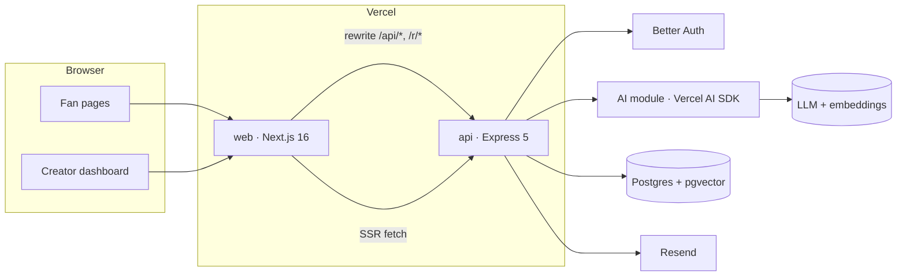

# 02 · Technical Requirements Document (TRD)

Status: draft v0.1 for review · Updated: 2026-10-01

## 1. Platforms

- Web only.
- Fan pages are mobile-first: designed at 375px, working from 360px.
- Creator dashboard is desktop-first: designed at 1440px, working from 1024px. Below 1024px the sidebar becomes an icon rail; below 768px a bottom nav shows Today, Inbox, Ideas, More.
- Browsers: last two versions of Chrome, Safari (iOS and macOS), Firefox, Edge.

## 2. Frontend and hosting

| Concern | Choice |
|---------|--------|
| Framework | Next.js 16 (App Router), React 19, TypeScript strict |
| Styling | Tailwind CSS v4, design tokens as CSS variables in `@theme` (see 04) |
| Components | shadcn/ui re-themed to the tokens; Magic UI only for number tickers and fade-ins |
| Data | Server Components for public pages; TanStack Query for dashboard and fan interactions |
| Forms | react-hook-form + zod, schemas imported from `shared/` |
| Charts | shadcn charts (Recharts) |
| Icons | lucide-react, `strokeWidth={1.5}` |
| Font | Inter via `next/font` |
| Toasts | sonner |
| Hosting | Vercel project `fellow-owners-web` |

- `proxy.ts` (Next 16's replacement for middleware) redirects signed-out users away from `/dashboard/*` and member-only pages by checking for the session cookie. It is a convenience only; authorization always happens in the API.
- `next.config` rewrites `/api/:path*` and `/r/:code` to `API_URL`, so the browser only ever talks to the web origin.
- Server Components call the API directly at `API_URL` and forward the request cookie.
- Public pages (`/{handle}`, `/{handle}/s/{slug}`) render on the server with 60-second revalidation and Open Graph images from `next/og`.

## 3. Backend and database

| Concern | Choice |
|---------|--------|
| Runtime | Node.js 24 LTS |
| Framework | Express 5, TypeScript, ESM |
| Shape | Monolith organized by layer: `routes -> controllers -> services -> repositories -> db`, wired in `container.ts`, with `auth/`, `ai/` and `workers/` as their own folders. Routes are thin; controllers shape requests and responses; services hold rules and authorization; repositories hold Drizzle queries. Full tree in 07-file-structure |
| Validation | zod middleware for body, params and query, using `shared/` schemas |
| Errors | `AppError(code, status, message)`; one error middleware returns `{ "error": { "code", "message" } }`; unknown errors are logged and returned as 500 `internal_error` |
| Logging | pino JSON with request id; redacts `email`, `cookie`, `authorization` |
| Database | Postgres 15+ (as provisioned by Supabase) with the `vector` extension. Supabase used only as a database |
| Region | Colocate DB and functions: Supabase `us-east-1`, Vercel functions `iad1` |
| ORM | Drizzle ORM, drizzle-kit SQL migrations committed to the repo |
| Driver | postgres.js through the Supabase transaction pooler (port 6543) with `prepare: false` |
| Hosting | Vercel project `fellow-owners-api`; Express deploys zero-config as one function on Fluid compute |

### API surface

Web routes live under `/dashboard`; the matching creator API lives under `/api/studio`. Lists use cursor pagination on `(created_at, id)`.

| Area | Endpoints |
|------|-----------|
| Auth | `/api/auth/*` (Better Auth), `POST /api/demo/session` |
| Public | `GET /api/spaces/:handle`, `GET /api/spaces/:handle/showcase/:slug`, `GET /r/:code` |
| Member | `POST /api/spaces/:handle/join`, `POST /api/spaces/:handle/suggest-communities`, `GET /api/spaces/:handle/communities/:slug/posts`, `POST /api/spaces/:handle/posts`, `GET/PATCH/DELETE /api/posts/:id`, `POST /api/posts/:id/comments`, `PUT/DELETE /api/posts/:id/signals/:kind`, `POST /api/posts/:id/team`, `PATCH /api/posts/:id/team/:membershipId`, `POST /api/spaces/:handle/pitches`, `PATCH /api/pitches/:id` (withdraw), `GET /api/spaces/:handle/me` |
| Creator | `POST /api/studio/space` (onboarding), `GET /api/studio/overview`, `POST /api/studio/sweep`, `GET /api/studio/briefing`, `POST /api/studio/briefing/regenerate`, `GET /api/studio/inbox`, `PATCH /api/studio/inbox/:id`, `GET /api/studio/ideas`, `GET /api/studio/people`, `GET/POST/PATCH /api/studio/communities`, `PATCH /api/studio/posts/:id` (hide, rescore), `GET/POST/PATCH /api/studio/promotions`, `PUT /api/studio/settings`, `POST /api/studio/feedback` |

## 4. Authentication and roles

- Better Auth mounted in Express at `/api/auth/*splat`, registered before `express.json()`. Drizzle adapter on the same database.
- Sign-in methods: 6-digit email code (Better Auth `emailOTP`, sent with Resend) and Google OAuth. Codes, not magic links, because fans arrive inside Instagram, TikTok and YouTube in-app browsers: a magic link opens in a different browser and the session lands there. Google blocks OAuth inside those in-app browsers, so the web app hides the Google button when it detects one.
- Email and password: enabled for seeded demo accounts only and never shown in the UI, unless the open decision in 01 (Q8) turns password sign-in on for everyone, which adds the forgot and reset pages.
- Demo mode: `POST /api/demo/session { "as": "creator" | "fan" }` signs into the seeded demo accounts on the server and sets the session cookie. Off when `DEMO_ENABLED=false`.
- Sessions: httpOnly, secure, `sameSite=lax` cookies; 7-day expiry, refreshed daily. `baseURL` is the web origin; `trustedOrigins` lists production, preview and localhost web origins.
- Roles are per space: `owner` (the creator) and `member`. Platform `admin` is an email allowlist in env (demo reset, support). In the MVP a user owns at most one space and can be a member of many.

## 5. External services and APIs

| Provider | Purpose | Limits and notes | Credentials owner |
|----------|---------|------------------|-------------------|
| LLM via Vercel AI SDK (default OpenAI; Anthropic or Google by env) | Triage, suggestions, briefing, drafts | Two tiers set in env: `AI_MODEL_FAST`, `AI_MODEL_SMART`. Per-space daily token budget | Nilesh |
| Embeddings (default OpenAI `text-embedding-3-small`, 1536 dims) | Similar ideas, people matching, semantic search | Dimension is fixed in the schema; changing it needs a migration | Nilesh |
| Supabase | Postgres + pgvector, backups | Free projects pause after a week idle; use a paid project for the pilot | Nilesh |
| Vercel | Hosting, cron, logs, firewall | Hobby cron runs at most daily, which is enough for the demo reset | Nilesh |
| Resend | Sign-in codes and notification email | Needs a verified sending domain | Nilesh |
| Google Cloud OAuth client | Google sign-in | In testing mode only listed test users can sign in until the app is verified | Nilesh |
| YouTube Data API v3 (P2) | Comment import | Daily quota; check before building F24 | Nilesh |

## 6. Architecture



### Repo layout

```
fellow-owners/
  web/                Next.js 16
  api/                Express 5, including db/ (Drizzle schema, migrations, seed)
  shared/             zod schemas, enums, limits used by both
  docs/               build docs + design-reference/
  .github/            CI workflows
  docker-compose.yml  local Postgres + api + web
```

The full tree and naming rules are in 07-file-structure.

### Key data flows

1. **New post or pitch.** Validate -> insert with `analysis_status = pending` -> respond 201 -> `waitUntil(analyze(id))`: triage on the fast model and embedding in parallel -> update the row -> `done`. On error: `analysis_attempts + 1`, status `failed` after 3 attempts, error message stored.
2. **Sweep.** The dashboard calls `POST /api/studio/sweep` on load. The API claims up to 25 pending or retryable items for that space with `FOR UPDATE SKIP LOCKED` and analyzes them 5 at a time inside `waitUntil`. Safe to call repeatedly.
3. **Briefing.** `GET /api/studio/briefing` returns today's cached digest. If none exists it builds candidates in code (top ideas, top pitches, rising people, per-community counts, max 40 items) and asks the smart model to write 3 to 5 highlights that reference candidate ids only. Any id not in the candidate list is dropped.
4. **Promote.** `POST /api/studio/promotions { postId }` -> smart model writes drafts per platform -> stored as a draft. Publish sets `published_at`, creates `showcase_slug` and `short_code`, sets the post's `featured_at`.
5. **Click.** `GET /r/{code}` records a click with platform (`?p=`) and referrer host, then redirects 302 to `/{handle}/s/{slug}`.

Local development has no `waitUntil`; the AI module falls back to fire-and-forget promises with error logging.

### AI tasks

| Task | Tier | Input | Output (zod-validated) | Budget |
|------|------|-------|------------------------|--------|
| `triageItem` | fast | item text (cut to 4,000 chars), type, community, taste profile | `{ category, isSpam, summary (<=140), fitScore 0..100, fitReason (<=220), tags (<=5), skills (<=5) }` | Once per item; rerun only when content hash or taste version changes |
| `embedItem` | embeddings | title + body | vector(1536) | Once per item |
| `suggestCommunities` | fast | member intro, community list | `[{ slug, confidence }]` | 10 per user per hour |
| `briefing` | smart | candidates (ids, summaries, scores), counts | `{ headline, highlights[3..5]{ refType, refId, why }, watchouts[0..2] }` | 1 per space per day, plus up to 5 regenerations |
| `promoteDrafts` | smart | post, team, voice samples, taste profile | `{ x, instagram, linkedin, youtube }`, each `{ text, hashtags }` within platform length limits | 10 per space per day |
| `communityDigest` (P1) | smart | last 7 days of one community | `{ summary, themes, standouts }` | 1 per community per day |
| `suggestReply` (P1) | fast | pitch + taste profile | `{ reply }` | On demand |
| `clusterImport` (P1) | smart | up to 500 comments | `{ communities[{ name, description, sampleQuotes }] }` | Per import |
| `askAI` (P1) | smart | question + top 20 semantic matches | answer citing item ids | 30 per space per day |

Every call writes a row to `ai_runs` (task, model, tokens, latency, status). Budget checks read from it.

### Ranking (deterministic code, unit tested)

The model scores single items and writes text. Code does all ordering, so rankings stay explainable, cheap and testable.

- **Idea score** = `0.5 * fit + 0.3 * signal + 0.2 * recency`, each in 0..1
  - `fit = ai_fit_score / 100` (0.5 while pending)
  - `signal = min(1, log1p(use + 2 * build + 0.5 * comments) / log1p(50))`
  - `recency = 0.5 ^ (age_hours / 72)`
- **Inbox "Fit" sort:** non-filtered pitches by `ai_fit_score` desc, then newest first. Pending items sort as 50.
- **Rising people** (14-day window): sum over the member's posts of `fit * (1 + log1p(signals received))`, plus 0.1 per accepted team join. Top 10.

### Overview metrics (Today screen)

| Metric | Definition | Trend compares with |
|--------|------------|---------------------|
| Members | memberships with `removed_at` null | count 7 days ago |
| Ideas this week | posts of any type created in the last 7 days, not deleted | previous 7 days |
| Opportunities waiting | pitches with status `new`, not filtered, `ai_fit_score >= 70` | previous 7 days |
| This week card | joins, ideas, pitches as Total / This month / Today | none |
| Inbox mix | pitches in the last 30 days by AI category, plus filtered spam as its own slice | none |
| Fanbase activity | weekly joins and weekly posts, last 12 weeks | none |

### Prompt injection and trust

- Fan-written text is untrusted. Prompts wrap it in a delimited data block and the system prompt says to ignore instructions inside it.
- AI output is data only: scores, summaries, drafts. No tool calls, no automatic actions on fan content.
- Scores are clamped to 0..100. Briefing references are checked against the candidate list. Drafts are always editable and never published without a creator click.

## 7. Security and privacy

- Sensitive data: emails, names, profile links, pitch content. No payments, no government IDs.
- Emails are never shown to creators or other members. Creators reply to pitches in-app.
- Authorization lives in services via `requireMember(spaceId)` and `requireOwner(spaceId)`. Every query on space-scoped tables filters by `space_id`. The full matrix is in 05.
- Write caps per user per space per day: pitches 5, posts 20, comments 100. Community suggestions 10 per hour. Vercel Firewall rate rules cover IP-level abuse on public endpoints.
- Input limits come from shared zod schemas; links must be `http(s)`.
- Helmet headers on the API. Cookies httpOnly, secure, `sameSite=lax`. Better Auth origin checks via `trustedOrigins`.
- Secrets live only in Vercel env vars; `.env.example` lists names, never values.
- Retention: click events 180 days, `ai_runs` 90 days. Account deletion removes memberships and profile data; posts stay, attributed to "Former member", unless full deletion is requested.

## 8. Performance and reliability targets

| Metric | Target |
|--------|--------|
| Bio link page TTFB (cached) | < 300 ms p75 |
| Dashboard API reads (no AI) | < 400 ms p95 |
| Triage done after submit | < 15 s p90 |
| Briefing generation (cold) | < 20 s; cached < 300 ms |
| Promote drafts | < 20 s |
| Availability | Best effort on Vercel + Supabase; no SLA in the MVP |
| Backups | Supabase daily backups on the paid pilot project; demo data reproducible from seed |

If the LLM is down or the budget is used up, everything except AI fields keeps working. Items show "AI pending" and the next sweep picks them up.

## 9. Environments and delivery

| Env | Web | API | Database |
|-----|-----|-----|----------|
| Local | `localhost:3000` | `localhost:4000` | Docker `pgvector/pgvector:pg17` |
| Preview | Vercel preview per PR | `staging` API (deployed from `main`) | `staging` Supabase project |
| Production | `fellow-owners-web` | `fellow-owners-api` | `prod` Supabase project |

- `pnpm dev` runs both apps through Turborepo; web rewrites `/api/*` to `localhost:4000`.
- CI on every PR (GitHub Actions): install, typecheck, lint, Vitest unit tests, API integration tests (Vitest + Supertest against a Postgres service container), build both apps.
- Playwright E2E of the judge path against the staging deployment (P1).
- `pnpm db:migrate` runs before the API deploys. Seed runs only locally, on staging, and for the demo space.
- Rollback: Vercel instant rollback for both apps. Migrations in v1 are additive only.
- Vercel Cron: daily at 00:00 UTC, reset the demo space from seed.

## 10. Key technical decisions and tradeoffs

| # | Decision | Reason | Alternative considered |
|---|----------|--------|------------------------|
| D1 | Separate Express API, not Next route handlers | A backend boundary you own, reusable for a future mobile app; your chosen stack | Route handlers: one deploy, but logic tangled into the web app |
| D2 | One monolith, organized by layer | Solo builder, domain still forming, fastest iteration; layers match your usual layout | Services per domain: operational cost with no benefit yet |
| D3 | Postgres + pgvector for everything | One store, joins between vectors and rows, fewer moving parts | Separate vector DB: more infra for about 10K vectors |
| D4 | Better Auth inside the API | Auth sits with business logic, database-agnostic, your choice | Supabase Auth: vendor tie-in and a second client |
| D5 | Same origin through Next rewrites | First-party cookies, no CORS | Cross-site cookies with `sameSite=none`: fragile across browsers |
| D6 | `waitUntil` + sweep instead of a queue | Fits serverless with zero extra infra; sweep gives at-least-once processing | pg-boss or Redis queue: needs an always-on worker |
| D7 | AI scores single items, code ranks lists | Explainable, testable, cheap, stable | LLM-ranked lists: opaque and non-deterministic |
| D8 | Copy and share intents for promotion | No platform app reviews or OAuth scopes in v1 | Posting APIs: weeks of approvals |
| D9 | Seed content generated once and committed, AI fields prefilled (embeddings backfilled separately) | Demo works with no API key and looks the same every time | Generating at seed time: slow, costs money, varies |
| D10 | Vercel AI SDK, provider chosen by env | Swap providers in one line; structured output with zod | Direct vendor SDK: lock-in |
| D11 | Email codes instead of magic links | Works inside Instagram, TikTok and YouTube in-app browsers, where most fans arrive | Magic links: the session lands in the wrong browser |
