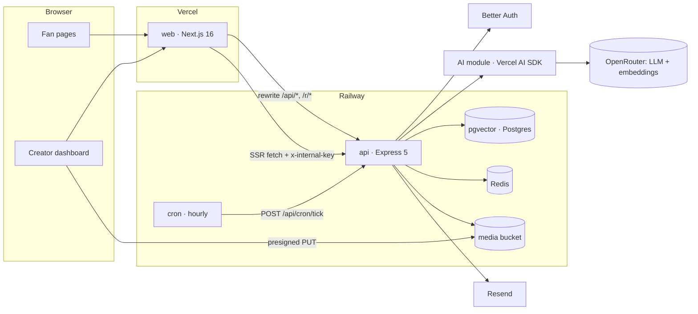

# 02 · Technical Requirements Document (TRD)

Status: draft v0.2 for review · Updated: 2026-10-10

## 1. Platforms

- Web only.
- Fan pages are mobile-first: designed at 375px, working from 360px.
- Creator dashboard is desktop-first: designed at 1440px, working from 1024px. Below 1024px the sidebar becomes an icon rail; below 768px a bottom nav shows Today, Inbox, Ideas, More.
- Browsers: last two versions of Chrome, Safari (iOS and macOS), Firefox, Edge.

## 2. Frontend and hosting

| Concern | Choice |
|---------|--------|
| Framework | Next.js 16 (App Router), React 19, TypeScript strict |
| Styling | Tailwind CSS v4, design tokens as CSS variables in `@theme` (see 04) |
| Components | shadcn/ui re-themed to the tokens; Magic UI only for number tickers and fade-ins |
| Data | Server Components for public pages; TanStack Query for dashboard and fan interactions |
| Forms | react-hook-form + zod, schemas imported from `shared/` |
| Charts | shadcn charts (Recharts) |
| Icons | lucide-react, `strokeWidth={1.5}` |
| Font | Inter via `next/font` |
| Toasts | sonner |
| Hosting | Vercel (project `fellow-owners-web`) |

- `proxy.ts` (Next 16's replacement for middleware) redirects signed-out users away from `/dashboard/*` and member-only pages by checking for the session cookie. It is a convenience only; authorization always happens in the API.
- `next.config` rewrites `/api/:path*` and `/r/:code` to `API_URL`, so the browser only ever talks to the web origin. It also redirects `/sign-up` to `/create-account`, `/refunds` to `/terms#refunds` and `/dashboard/asks` to `/dashboard/challenges` (permanent).
- Server Components call the API directly at `API_URL` and forward the request cookie. Every such read also sends `INTERNAL_API_KEY` as `x-internal-key`, so the API skips its per-IP rate limits for the web server (all its reads leave from Vercel's IPs).
- Public pages (`/{handle}`, `/{handle}/s/{slug}`) render on the server with 60-second revalidation and Open Graph images from `next/og`.
- Web environment variables (Vercel project settings; names only):

| Variable | What it does |
|----------|--------------|
| `API_URL` | Origin of the Railway `api` service. Used by the rewrites in `next.config.ts` and by server-side reads (`lib/server-api.ts`). Required outside development; the web build uses `http://localhost:4000` in CI |
| `NEXT_PUBLIC_APP_URL` | Public web origin, used to build links people copy or scan (bio link, short link, QR). Optional: falls back to `VERCEL_PROJECT_PRODUCTION_URL` on the server and to the page's own origin in the browser |
| `INTERNAL_API_KEY` | Server-only secret, 32+ characters, the same value as on the `api` service. Sent as `x-internal-key` on server-side reads to skip the API's per-IP rate limits. Never `NEXT_PUBLIC_*` |

## 3. Backend and database

| Concern | Choice |
|---------|--------|
| Runtime | Node.js 24 LTS |
| Framework | Express 5, TypeScript, ESM |
| Shape | Monolith organized by layer: `routes -> controllers -> services -> repositories -> db`, wired in `container.ts`, with `auth/`, `ai/` and `workers/` as their own folders. Routes are thin; controllers shape requests and responses; services hold rules and authorization; repositories hold Drizzle queries. Full tree in 07-file-structure |
| Validation | zod middleware for body, params and query, using `shared/` schemas |
| Errors | `AppError(code, status, message)`; one error middleware returns `{ "error": { "code", "message" } }`; unknown errors are logged and returned as 500 `internal_error` |
| Logging | pino JSON with request id; redacts `email`, `cookie`, `authorization` |
| Database | Postgres with the `vector` extension (pgvector), a service in the Railway project. Local Docker uses `pgvector/pgvector:pg17` |
| ORM | Drizzle ORM, drizzle-kit SQL migrations committed to the repo (`api/src/db/migrations`, 0000 to 0008) |
| Driver | postgres.js with `prepare: false`; pool of 5 per process in production (`DATABASE_POOL_MAX`), 10 locally |
| Cache and pub/sub | Redis, a service in the Railway project (`REDIS_URL`). Holds Better Auth rate-limit counters, the API's own rate-limit counters and daily caps, the per-address code throttle and the notifications pub/sub. Optional: without it all four stay in process memory |
| Media | An S3-compatible Railway bucket `media` (`BUCKET_*`). Uploads are presigned PUTs; reads go through `GET /api/media/*key`, which redirects (302) to a short-lived presigned GET. Off when the four required `BUCKET_*` values are unset |
| Hosting | Railway project with five parts: the `api` service, a `pgvector` Postgres service, a Redis service, a `cron` service and the `media` bucket (below) |

### Railway services

| Service | What it runs | Notes |
|---------|--------------|-------|
| `api` | Built from `api/Dockerfile` (build context is the repo root; Node 24 alpine; runs `node dist/local.js` on `PORT`, default 4000) | Pre-deploy command `node dist/db/migrate.js` applies the SQL migrations (it reads only `DATABASE_URL`) before the new container takes traffic. The image has a Docker `HEALTHCHECK` on `GET /api/health`, which answers 503 when the database fails a `select 1` within 2 seconds. The pnpm build cache mounts use ids prefixed with the api service id, as Railway requires. `RAILWAY_DEPLOYMENT_DRAINING_SECONDS` gives open requests time to finish on a deploy; on SIGTERM the server stops accepting, closes notification streams, waits up to 10 seconds for background work and exits (forced exit after 15 seconds) |
| `pgvector` | Postgres with the `vector` extension | `DATABASE_URL` of the `api` service points at it over the private network. Migration 0000 enables the extension |
| Redis | Redis | `REDIS_URL` on the `api` service. The client reconnects by itself; while Redis is down, auth rate limiting fails open and the API's own limits count in process |
| `cron` | A scheduled service, cron `0 * * * *` (hourly), whose start command calls `POST /api/cron/tick` on the `api` service with `Authorization: Bearer $CRON_SECRET` and exits | The tick answers 202 at once and runs its jobs in the background. See "Scheduled jobs" |
| `media` bucket | S3-compatible object storage | Its credentials are referenced by the `api` service as `BUCKET_ENDPOINT`, `BUCKET_NAME`, `BUCKET_ACCESS_KEY_ID`, `BUCKET_SECRET_ACCESS_KEY`. Browsers PUT to it directly, so its CORS must allow PUT and GET from the web origins (production, previews, localhost). That is set once on the bucket, not in the repo |

The `api` service is a long-lived Node process (`src/local.ts`), not a serverless function. `src/index.ts` still default-exports the app for a Vercel-style entry; background work uses `waitUntil` when a Vercel request context exists and plain promises otherwise (`workers/schedule.ts`).

### Environment variables (`api` service)

Defined and checked with zod in `api/src/config/env.ts`; a bad or missing value stops the process on boot with the full list of problems. `api/.env.example` lists the names. Development and test have defaults, so `pnpm dev` needs only Docker Postgres. "Prod" is whether production requires it.

| Variable | Prod | What it does |
|----------|------|--------------|
| `NODE_ENV` | | `development`, `test` or `production` (default `development`) |
| `PORT` | | Listening port, default 4000 |
| `TRUST_PROXY_HOPS` | | Proxy hops in front of the API whose `X-Forwarded-For` entries are trusted for the client IP (Express `trust proxy`), 0 to 5, default 2 (Vercel's edge for the `/api` rewrite, then Railway's edge). 1 when clients call Railway directly, 0 with no proxy. A forged left-most entry cannot change the IP the per-IP limits count |
| `LOG_LEVEL` | | `fatal` to `silent`; default `debug` in development, `info` in production, `silent` in test |
| `DATABASE_URL` | required | `postgres://` or `postgresql://` connection string |
| `DATABASE_POOL_MAX` | | postgres.js pool size, 1 to 100; default 5 in production, 10 otherwise |
| `REDIS_URL` | optional | `redis://` or `rediss://`. Rate-limit counters, code throttle, notifications pub/sub; in process when unset |
| `WEB_ORIGIN` | | The web origin (default `http://localhost:3000`). Showcase and short links point here; it is always a trusted origin |
| `TRUSTED_ORIGINS` | | Comma-separated extra origins Better Auth trusts (preview deployments, other localhost ports); `*` wildcards allowed, e.g. a preview-domain pattern. `https://appleid.apple.com` is added when Apple sign-in is on |
| `BETTER_AUTH_SECRET` | required | Signs sessions and encrypts stored codes and OAuth tokens; at least 32 characters in production |
| `BETTER_AUTH_URL` | | The WEB origin, because `/api/auth` is reached through the web rewrite; defaults to `WEB_ORIGIN`. OAuth redirect URIs are `{BETTER_AUTH_URL}/api/auth/callback/{google\|apple\|facebook}` |
| `RESEND_API_KEY` | required | Sends confirmation, reset and delete-account codes, notification digests and newsletter mail. Without it (dev) messages are logged, not sent |
| `EMAIL_FROM` | required with the key | Sender, default `Fellow Owners <onboarding@resend.dev>` |
| `GOOGLE_CLIENT_ID`, `GOOGLE_CLIENT_SECRET` | optional | Google sign-in; both or neither |
| `APPLE_CLIENT_ID`, `APPLE_CLIENT_SECRET` | optional | Sign in with Apple (Services ID and a JWT you sign; it lives 6 months at most); both or neither |
| `APPLE_APP_BUNDLE_IDENTIFIER` | optional | Only for ID-token sign-in from a native iOS app |
| `FACEBOOK_CLIENT_ID`, `FACEBOOK_CLIENT_SECRET` | optional | Meta login (stands in for Instagram); both or neither |
| `OPENROUTER_API_KEY` | optional | Live AI through OpenRouter. Without it the deterministic fake AI runs |
| `AI_MODEL_FAST` | | Fast tier model, default `openai/gpt-5.6-luna` |
| `AI_MODEL_SMART` | | Smart tier model, default `anthropic/claude-sonnet-5.5` |
| `AI_EMBEDDING_MODEL` | | Embedding model, default `openai/text-embedding-3-small` (1536 dimensions, fixed by the schema) |
| `AI_ENABLED` | | Kill switch. Defaults to "an OpenRouter key is present"; `true` without a key stops the boot |
| `FAL_KEY` | optional | fal.ai key for image and video generation (seed assets; no v1 route generates media) |
| `APIFY_TOKEN` | optional | Server-only token for public profile lookups in onboarding and the daily follower refresh. Never logged |
| `APIFY_ENABLED` | | Live Apify lookups; defaults to "`APIFY_TOKEN` is set". Without it lookups answer labelled sample profiles |
| `YOUTUBE_API_KEY` | optional | YouTube Data API v3 key for comment import. Without it the import returns labelled sample data |
| `BUCKET_ENDPOINT` | optional | S3-compatible bucket endpoint (a URL). `BUCKET_ENDPOINT`, `BUCKET_NAME`, `BUCKET_ACCESS_KEY_ID` and `BUCKET_SECRET_ACCESS_KEY` come as a set, or none; a partial set stops the boot. With none, uploads are off (`/api/uploads/presign` and `/api/media` answer 503 `uploads_disabled`) |
| `BUCKET_REGION` | | Default `auto` |
| `BUCKET_NAME`, `BUCKET_ACCESS_KEY_ID`, `BUCKET_SECRET_ACCESS_KEY` | with the set | The rest of the bucket credentials |
| `DEMO_ENABLED` | | Demo mode, default true. Off: no demo sign-in, no demo reset |
| `DEMO_CREATOR_EMAIL`, `DEMO_FAN_EMAIL`, `DEMO_PASSWORD` | required when demo is on | The two seeded demo accounts (the emails must differ; password at least 8 characters) |
| `ADMIN_EMAILS` | | Comma-separated platform admin allowlist (lowercased); guards `POST /api/admin/demo-reset` |
| `CRON_SECRET` | required | Bearer secret for `/api/cron/*` |
| `CLICK_SALT` | required | Salt for visitor hashes in click and page-visit counts |
| `INTERNAL_API_KEY` | optional | 32+ characters; requests sending it as `x-internal-key` skip the API's per-IP rate limits. Same value as on the web project |
| `VERCEL_GIT_COMMIT_SHA`, `RAILWAY_GIT_COMMIT_SHA`, `npm_package_version` | | Read for the short build id in `GET /api/health` (`version`) |

### API surface

Web routes live under `/dashboard`; the matching creator API lives under `/api/studio`. Lists use cursor pagination on `(created_at, id)`. Everything is under `/api` except `GET /r/:code` and Better Auth, which is mounted at `/api/auth/*splat` before `express.json()`. Responses on authenticated routes are `Cache-Control: no-store`.

| Area | Endpoints |
|------|-----------|
| Platform | `GET /api/health` (`{ status, db, ai, version }`; 503 when the database is down), `GET /api/config` (public: enabled providers, demo, uploads, YouTube import), `POST /api/support/requests` (contact and privacy forms; 5 per hour per IP; the fixed-text acknowledgement email goes at most once per address per 24 hours and 50 times a day in all, admin notices at most 200 a day; the request is stored either way), `POST /api/newsletter` (5 per minute per IP), `GET/POST /api/newsletter/confirm`, `GET/POST /api/newsletter/unsubscribe` (a GET only redirects to the web page with the token; the POST, from that page's button or a mail client's one-click unsubscribe, changes the state) |
| Auth | `/api/auth/*` (Better Auth), `POST /api/demo/session` (10 per minute per IP, and 300 per hour in all) |
| Public | `GET /api/spaces/:handle`, `GET /api/spaces/:handle/showcase/:slug`, `GET /api/handle-available` (30 per minute), `GET /r/:code`; public reads are limited to 120 per minute per IP. `POST /api/spaces/:handle/visit` counts a bio-page visit (30 per minute; at most 5,000 counted per space per day, the rest dropped) |
| Account | `GET /api/me/export` (the signed-in person's data), `GET/PUT /api/me/notification-prefs`, `GET/POST /api/email/unsubscribe` (signed token; a GET only redirects to `/email-preferences?token=`, the POST from that page's button or a mail client's one-click unsubscribe unsubscribes), `POST /api/uploads/presign` (30 per hour and 100 per day per user), `GET /api/media/*key` (600 per minute per IP) |
| Member | `GET /api/spaces/:handle/membership`, `POST .../join`, `POST .../suggest-communities`, `GET/PATCH .../me`, `DELETE .../me` (leave), `GET .../communities/:slug/posts`, `POST .../posts`, `POST .../pitches`, `POST .../coach` (Idea Coach), `GET .../challenges`, `POST .../challenges/:id/entries`; `GET/PATCH/DELETE /api/posts/:id`, `POST /api/posts/:id/comments`, `DELETE /api/posts/:id/comments/:commentId`, `PUT/DELETE /api/posts/:id/signals/:kind`, `POST /api/posts/:id/team`, `PATCH /api/posts/:id/team/:membershipId`, `GET /api/posts/:postId/similar`, `POST /api/posts/:postId/report`, `POST /api/comments/:commentId/report`, `PATCH /api/pitches/:id` (withdraw) |
| Notifications | `GET /api/notifications`, `GET /api/notifications/unread`, `GET /api/notifications/stream` (SSE), `POST /api/notifications/read` |
| Creator: space | `GET /api/studio/handle-check`, `POST /api/studio/space` (onboarding), `GET /api/studio/space`, `PUT /api/studio/settings`, `POST /api/studio/platform-lookup`, `POST /api/studio/setup-suggestions`, `POST /api/studio/checklist`, `GET /api/studio/metrics` |
| Creator: today and inbox | `GET /api/studio/overview`, `POST /api/studio/sweep`, `GET /api/studio/briefing`, `POST /api/studio/briefing/regenerate`, `POST /api/studio/feedback`, `GET /api/studio/inbox`, `GET/PATCH /api/studio/inbox/:id`, `POST /api/studio/inbox/:id/suggest-reply`, `POST/DELETE /api/studio/snoozes`, `POST /api/studio/ask` (Ask your AI) |
| Creator: ideas and people | `GET /api/studio/ideas`, `GET/PATCH /api/studio/posts/:id`, `POST/DELETE /api/studio/posts/:id/love`, `GET /api/studio/posts/:postId/similar`, `GET /api/studio/people`, `DELETE /api/studio/people/:membershipId`, `PUT /api/studio/people/:membershipId/communities`, `POST .../spotlight/draft`, `PUT/DELETE .../spotlight` |
| Creator: communities and promotion | `GET/POST /api/studio/communities`, `GET /api/studio/communities/:slug`, `PATCH /api/studio/communities/:id`, `GET/POST/PATCH /api/studio/promotions`, `GET /api/studio/promotions/post/:postId` |
| Creator: audience | `GET/POST /api/studio/followers`, `POST .../import`, `POST .../import/youtube` (live imports of a valid channel link: 3 per space per day, 50 per day in all; sample data and invalid links do not count), `POST .../tag`, `POST .../auto-tag`, `PATCH/DELETE .../:id`; `GET /api/studio/analytics/communities`; `GET /api/studio/export/:kind` (ideas, people, followers, pitches as CSV) |
| Creator: challenges | `GET/POST /api/studio/challenges`, `GET /api/studio/challenges/:id`, `POST .../:id/close`, `POST .../:id/winner` |
| Creator: answer once and moderation | `GET /api/studio/question-groups`, `POST .../:id/answer`, `POST .../:id/redraft`, `POST .../:id/dismiss`, `DELETE .../:id/askers/:pitchId`; `GET /api/studio/reports`, `PATCH /api/studio/reports/:id`, `PATCH /api/studio/posts/:postId/comments/:commentId` (hide) |
| Admin and cron | `POST /api/admin/demo-reset` (session whose email is in `ADMIN_EMAILS`); `GET/POST /api/cron/tick[?job=<name>]`, `GET /api/cron/status`, `GET/POST /api/cron/demo-reset`, `GET/POST /api/cron/purge`, `GET/POST /api/cron/refresh-followers` (all `Authorization: Bearer $CRON_SECRET`) |

Other limits: platform profile lookups are 5 per minute and 30 per day per user, and 500 per day across the platform; onboarding setup suggestions are 10 per day per user.

## 4. Authentication and roles

- Better Auth mounted in Express at `/api/auth/*splat`, registered before `express.json()`. Drizzle adapter on the same database.
- Sign-in methods (01, Q8, decided 2026-10-02): email or username + password (Better Auth `emailAndPassword` + `username`), or Google, Apple and Facebook OAuth, each on only when its env pair is set (Facebook stands in for Instagram, which has no login for personal accounts). A new email account gets no session until it confirms its email with a 6-digit code (`emailOTP` with `overrideDefaultEmailVerification`, sent with Resend), and a forgotten password is reset with a code too. Codes, not magic links, because fans arrive inside Instagram, TikTok and YouTube in-app browsers: a magic link opens in a different browser and the session lands there. Google blocks OAuth inside those in-app browsers, so the web app hides the Google button when it detects one; Apple and Facebook stay.
- Codes: 6 digits, 10 minutes, 5 attempts. They are stored encrypted (not hashed) so a resend inside the 10 minutes repeats the same code (`resendStrategy: reuse`); a resend dropped by the throttle then leaves the code already in the inbox working. Sign-up answers `{ token: null }` for an address that already has an account, and sends no email, so nobody can probe which emails exist. Logging in to an unconfirmed account answers 403 `EMAIL_NOT_VERIFIED` and emails a fresh code.
- Per-address code throttle (production only): at most one code email per address per 60 seconds and 5 per 15 minutes (a short window, so asking for codes cannot lock a person out of sign-in for a day), counted in Redis when `REDIS_URL` is set and in process otherwise. Above that the email is dropped silently, the answer to the request is unchanged, and the earlier code still works.
- Someone may sign up first with another person's email, so confirming an account that has a password also needs that password (`password` in the `verify-email` body; 401 `INVALID_EMAIL_OR_PASSWORD` otherwise, and the owner resets the password instead). Confirming or resetting drops every OAuth link and session made before the inbox was proven.
- Passwords: 8 to 128 characters, stored as Better Auth's salted scrypt hash in `account.password`. A reset by code ends every session (`revokeSessionsOnPasswordReset`). The link-based reset is disabled (`/request-password-reset`, `/reset-password`, `/forget-password`). `/change-password` is on: it needs the current password and ends the other sessions. `/list-sessions` and `/revoke-other-sessions` back the Account tab. `/sign-in/email-otp` stays on for API clients and the test helpers. Usernames follow the space-handle rules (shared `usernameSchema`) and are one namespace with space handles: a username that is another person's space handle answers 409 `HANDLE_TAKEN`.
- Deleting an account: `POST /delete-user` emails a 6-digit code (Better Auth's delete token, no link); sending it back as `{ token }` deletes the user. Before that, `beforeDelete` (`services/account.service.ts`) deletes the user's own space and their memberships elsewhere (their posts stay as "Former member"). The delete token lives as long as an auth code (10 minutes).
- Demo mode: `POST /api/demo/session { "as": "creator" | "fan" }` signs into the seeded demo accounts on the server and sets the session cookie. Off when `DEMO_ENABLED=false`. The demo accounts cannot change themselves or end other sessions (profile, password, email, delete, sessions and account-linking paths answer 403 `DEMO_READ_ONLY`).
- Rate limits: Better Auth's defaults per client IP and path, on in production only: sign-in and sign-up 3 per 10 seconds, the email-code endpoints 3 per minute, anything else 100 per 10 seconds; `/get-session` is not limited. With `REDIS_URL` set the counters live in Redis (shared by replicas, kept across deploys, each key expiring with its window; fails open if Redis is unreachable); without it they stay in process memory. Sessions stay in Postgres.
- Sessions: httpOnly, secure, `sameSite=lax` cookies; 7-day expiry, refreshed daily, with a 5-minute signed cookie cache so most API calls skip the session query. `baseURL` is the web origin; `trustedOrigins` is `WEB_ORIGIN` plus `TRUSTED_ORIGINS`. Google, Apple and Facebook tokens are stored encrypted with `BETTER_AUTH_SECRET`.
- Roles are per space: `owner` (the creator) and `member`. Platform `admin` is an email allowlist in env (`ADMIN_EMAILS`: demo reset). In the MVP a user owns at most one space and can be a member of many.

## 5. External services and APIs

| Provider | Purpose | Limits and notes | Credentials owner |
|----------|---------|------------------|-------------------|
| OpenRouter, through the Vercel AI SDK | Triage, suggestions, briefing, drafts, embeddings | Two chat tiers set in env: `AI_MODEL_FAST`, `AI_MODEL_SMART`, plus `AI_EMBEDDING_MODEL`. Per-space daily token budget (`spaces.ai_daily_token_budget`, default 200,000). Without a key the deterministic fake AI answers | Nilesh |
| fal.ai | Image and video generation (seed assets) | No v1 route generates media | Nilesh |
| Apify | Public profile lookups for onboarding and the daily follower refresh | Monthly spend limit set in the Apify console; per-user and platform-wide daily lookup caps in the API | Nilesh |
| YouTube Data API v3 | Comment import (`POST /api/studio/followers/import/youtube`) | Up to 10 videos and 500 comments per import; daily quota applies | Nilesh |
| Railway | Hosts the API, Postgres with pgvector, Redis, the cron service and the media bucket | See "Railway services" | Nilesh |
| Vercel | Hosts the web app | Rewrites to the API | Nilesh |
| Resend | Email confirmation, password reset and delete-account codes, notification digests, newsletter mail | Needs a verified sending domain | Nilesh |
| Google Cloud OAuth client | Google sign-in | In testing mode only listed test users can sign in until the app is verified | Nilesh |
| Apple Developer: Sign in with Apple | Apple sign-in | Needs a paid developer account, a Services ID and a key. The client secret is a JWT signed with that key and lives 6 months at most: rotate it before it expires. Apple sends the name only on the first sign-in, and email reaches a hidden (private relay) address only once the sending domain is registered with Apple | Nilesh |
| Meta for Developers app | Facebook sign-in | In development mode only people with a role on the app can log in. Going live needs a privacy policy URL and data deletion instructions (`/privacy-policy#deletion`) | Nilesh |

## 6. Architecture



### Repo layout

```
fellow-owners/
  web/                Next.js 16
  api/                Express 5, including db/ (Drizzle schema, migrations, seed)
  shared/             zod schemas, enums, limits used by both
  docs/               build docs
  .github/            CI workflows
  docker-compose.yml  local Postgres + api (the web app runs with pnpm dev)
```

The full tree and naming rules are in 07-file-structure.

### Key data flows

1. **New post or pitch.** Validate -> insert with `analysis_status = pending` -> respond 201 -> background `analyze(id)`: triage on the fast model and embedding in parallel -> update the row -> `done`. On error: `analysis_attempts + 1`, status `failed` after 3 attempts, error message stored.
2. **Sweep.** The dashboard calls `POST /api/studio/sweep` on load. The API claims up to 25 pending or retryable items for that space with `FOR UPDATE SKIP LOCKED` (and a lease, `analysis_claimed_at`) and analyzes them 5 at a time in the background. Safe to call repeatedly. The hourly tick's `sweep` job does the same for every space with pending items, so analysis finishes even when the owner never opens the studio.
3. **Briefing.** `GET /api/studio/briefing` returns today's cached digest. If none exists it builds candidates in code (top ideas, top pitches, rising people, per-community counts, max 40 items) and asks the smart model to write 3 to 5 highlights that reference candidate ids only. Any id not in the candidate list is dropped.
4. **Promote.** `POST /api/studio/promotions { postId }` -> smart model writes drafts per platform -> stored as a draft. Publish sets `published_at`, creates `showcase_slug` and `short_code`, sets the post's `featured_at`.
5. **Click.** `GET /r/{code}` records a click with platform (`?p=`) and referrer host, then redirects 302 to `/{handle}/s/{slug}`.
6. **Notifications.** Emit points (new idea, challenge opened, pitch received, reply sent, project featured, team request, team decision, comment posted, post loved, fan spotlighted, challenge shortlisted, report filed) call `deps.notifications.notify(...)` after their transaction commits, logging errors and never throwing. Creator and fan bells get their unread count live from `GET /api/notifications/stream` (Server-Sent Events: the count on connect and after every change, a heartbeat every 25 seconds, at most 5 streams per user per instance). `notify()` and mark-read publish `{ userId, spaceId }` on a pub/sub: Redis pub/sub across replicas when `REDIS_URL` is set (one subscription per instance), in process otherwise. While the stream is down the bell polls `GET /api/notifications/unread` every 30 seconds (TanStack Query pauses it in a background tab and refetches on focus); with Redis unreachable the stream sends the count and closes with a 30-second retry. The list loads when the popover opens, 20 per page with Load more, each item with an href and a plain-text sentence. `POST /api/notifications/read` marks the given ids, or all unread, as read. The `email_digests` job emails each person their unread notifications of the kinds reply received, project featured, spotlighted, challenge shortlisted and team decision, honoring `notification_prefs` and a one-click unsubscribe link.
7. **Uploads.** `POST /api/uploads/presign { kind, contentType, size }` (kinds `avatar`, `space_cover`, `community_cover`, `member_avatar`; JPEG, PNG or WebP; at most 5 MB) answers a presigned PUT for a server-made key `<kind>/<userId or spaceId>/<uuid>.<ext>`. The browser PUTs the file to the bucket, then saves `/api/media/<key>` as the avatar or cover URL. Covers can only be presigned by the space owner. Before a new `/api/media/` URL is stored (studio settings avatar and cover, onboarding avatar, community cover, a fan's account image), the API reads the object's first 16 bytes and requires a JPEG, PNG or WebP signature; otherwise it deletes the object and answers 400 `validation_error`. It checks the signature only and does not decode or re-encode. `GET /api/media/*key` serves only keys of that shape (302 to a presigned GET valid for an hour, cached for 3000 seconds) without checking the bucket first; a missing object answers 404 at the bucket. Deleting an account also deletes the person's and their spaces' images from the bucket once the database transaction commits.
8. **Answer Once.** The hourly `group_questions` job embeds up to 50 un-embedded pitches per run, then groups pitches asking the same thing (cosine distance at most 0.3, at least 3 pitches, 30-day window) for spaces that received a groupable pitch in the last two hours. The smart model names the shared question and drafts one answer; the creator edits it, `POST .../answer` replies to every asker and can pin the answer as a post in chosen communities. Redrafts: 5 per group per day.
9. **Challenges.** A creator challenge is a row in `asks`. Fans enter with `POST /api/spaces/:handle/challenges/:id/entries` (an entry is a post with `ask_id` set). Closing (button, or the hourly `close_challenges` job once `due_at` has passed) shortlists entries, notifies, and stores an AI recap in `asks.response_summary`.
10. **Ask your AI.** `POST /api/studio/ask { question }` embeds the question, takes the 20 nearest posts and pitches and asks the smart model to answer citing them. Citations the model invents are dropped.

### Scheduled jobs

One Railway cron service calls `POST /api/cron/tick` every hour. The tick (`workers/tick.ts`) picks every job whose current slot has no `ok` row in `job_runs`, starts them one after another in the background and answers 202 `{ jobs }` at once. A slot is the hour start for hourly jobs, the latest scheduled hour (and weekday) for daily and weekly ones, in UTC. A daily or weekly job is due while its slot has no `ok` run, so a missed tick catches up at the next one. Each job runs under a Postgres advisory lock (`pg_try_advisory_xact_lock`) and re-checks its slot inside it, so overlapping ticks run each job once. `GET /api/cron/status` lists the last 50 runs. `POST /api/cron/tick?job=<name>` runs one job now, even if its slot is done.

| Job | Schedule (UTC) | What it does |
|-----|----------------|--------------|
| `sweep` | hourly | Analyzes pending, postponed or lease-expired posts and pitches in every space, 5 spaces at a time, 25 items per space |
| `group_questions` | hourly | Answer Once grouping (flow 8) |
| `close_challenges` | hourly | Closes overdue challenges (up to 100 per run) with the same path as the Close button, plus the AI recap |
| `email_digests` | hourly | Sends each person their due unread notifications as one email; a failed send keeps the watermark (`notification_prefs.last_digest_at`) and retries next run |
| `refresh_followers` | daily 06:00 | Refreshes follower counts of linked profiles in non-demo spaces through Apify, oldest `fetchedAt` first, at most 50 profiles per run; a failed or simulated lookup keeps the old count |
| `demo_reset` | daily 09:00 | Deletes the demo space and reseeds it from `db/seed/data/*.json`. Skipped when `DEMO_ENABLED=false` |
| `purge` | daily 09:00 | Retention rules in 05, section 8 |
| `community_digests` | Mondays 13:00 | One AI digest per non-archived community with a post in the last 7 days, dated that week's Monday |

The per-job endpoints (`/api/cron/demo-reset`, `/purge`, `/refresh-followers`) run to completion before answering, so their status code says whether the run succeeded.

### AI tasks

Code: `api/src/ai/tasks/*` (prompt, output schema, normalization) behind `ai/run.ts`. Every live call goes through `run.ts`: AI enabled, then today's tokens against the space budget, then the per-task cap, then the model call with zod validation and one retry on malformed output, then exactly one `ai_runs` row. Refusals before the model call write no row. When a task fails, the caller degrades (items show "AI pending"; lists render without AI fields).

| Task | Tier | Input | Output (zod-validated) | Cap |
|------|------|-------|------------------------|-----|
| `triageItem` | fast | item text (cut to 4,000 chars), type, community, taste profile, recent thumbs | `{ category, isSpam, summary (<=140), fitScore 0..100, fitReason (<=220), tags (<=5), skills (<=5) }` | Once per item; rerun only when content hash or taste version changes |
| `embedItem` | embedding | title + body | vector(1536) | Once per item |
| `suggestCommunities` | fast | member intro, community list | `[{ slug, confidence }]` | 10 per user per hour |
| `briefing` | smart | candidates (ids, summaries, scores), counts | `{ headline, highlights[3..5]{ refType, refId, why }, watchouts[0..2] }` | 1 per space per day, plus 5 regenerations |
| `promoteDrafts` | smart | post, team, voice samples, taste profile | one draft per platform `{ text, hashtags }` within platform length limits, plus a showcase headline | 10 per space per day |
| `tagFollowers` | fast | follower names and notes (up to 100 per call), active community names and descriptions | `{ tags: [{ follower, communities[1..2] }] }`, keys resolved back to ids | 50 calls per space per day |
| `clusterImport` | smart | up to 500 follower notes | `{ communities[{ name, description, sampleComments }] }` (2..6) | 5 calls per space per day |
| `communityDigest` | smart | last 7 days of one community | `{ summary, themes, standouts }` | One per community per week (weekly job); safety cap 2 x 20 per space per day |
| `suggestReply` | fast | pitch + taste profile | `{ reply }` | 30 per space per day |
| `askAI` | smart | question + top 20 semantic matches | answer citing item ids | 30 per space per day |
| `spotlightNote` | fast | fan name, intro, communities, top post | a note of at most 280 chars in the creator's voice | 30 per space per day |
| `coach` | fast | a pitch or post draft | clarity checklist and an optional rewrite; never a score | 10 per member per day, 300 per space per day. Exempt from the space token budget, so fans cannot drain the creator's AI |
| `questionGroup` | smart | pitches that asked the same thing | `{ isQuestion, question, draft }` | 50 per space per day; 5 redrafts per group per day |
| `challengeSummary` | fast | a closed challenge's entries | a short private recap; never ranks or judges entrants | 20 per space per day |
| `suggestSetup` | fast | imported public profiles in onboarding | "What you love" lines, voice quotes, up to 4 suggested groups; numbers are counted in code | No space yet, so no budget or `ai_runs` row; 10 per user per day |

Every call except `suggestSetup` writes a row to `ai_runs` (task, model, tokens, latency, status). Budget and cap checks read from it. Image and video generation (`ai/media.ts`, fal.ai) is available to the seed script and is not wired to any route.

### Ranking (deterministic code, unit tested)

The model scores single items and writes text. Code does all ordering, so rankings stay explainable, cheap and testable.

- **Idea score** = `0.5 * fit + 0.3 * signal + 0.2 * recency`, each in 0..1
  - `fit = ai_fit_score / 100` (0.5 while pending)
  - `signal = min(1, log1p(use + 2 * build + 0.5 * comments) / log1p(50))`
  - `recency = 0.5 ^ (age_hours / 72)`
- **Inbox "Fit" sort:** non-filtered pitches by `ai_fit_score` desc, then newest first. Pending items sort as 50.
- **Rising people** (14-day window): sum over the member's posts of `fit * (1 + log1p(signals received))`, plus 0.1 per accepted team join. Top 10.

### Overview metrics (Today screen)

| Metric | Definition | Trend compares with |
|--------|------------|---------------------|
| Members | memberships with `removed_at` null | count 7 days ago |
| Ideas this week | posts of any type created in the last 7 days, not deleted | previous 7 days |
| Opportunities waiting | pitches with status `new`, not filtered, `ai_fit_score >= 70` | previous 7 days |
| This week card | joins, ideas, pitches as Total / This month / Today | none |
| Inbox mix | pitches in the last 30 days by AI category, plus filtered spam as its own slice | none |
| Fanbase activity | weekly joins and weekly posts, last 12 weeks | none |

### Prompt injection and trust

- Fan-written text is untrusted. Prompts wrap it in a delimited data block (invisible characters and fake delimiters stripped) and the system prompt says to ignore instructions inside it.
- AI output is data only: scores, summaries, drafts. No tool calls, no automatic actions on fan content.
- Scores are clamped to 0..100. Briefing references are checked against the candidate list. Drafts are always editable and never published or sent without a creator click.

## 7. Security and privacy

- Sensitive data: emails, names, profile links, pitch content. No payments, no government IDs.
- Emails are never shown to creators or other members. Creators reply to pitches in-app.
- Authorization lives in services via `requireMember(spaceId)` and `requireOwner(spaceId)`. Every query on space-scoped tables filters by `space_id`. The full matrix is in 05.
- Write caps per user per space per day: pitches 5, posts 20, comments 100. Reports 20 per user per day. Community suggestions 10 per hour. Per-IP limits (Redis-backed when `REDIS_URL` is set, else per process) cover the public endpoints listed under "API surface"; the web server's own reads skip them with `INTERNAL_API_KEY`.
- Input limits come from shared zod schemas; links must be `http(s)`.
- Helmet headers on the API. Cookies httpOnly, secure, `sameSite=lax`. Better Auth origin checks via `trustedOrigins`. Cron routes compare the Bearer secret in constant time.
- Secrets live only in Railway and Vercel environment variables; `.env.example` lists names, never values.
- Retention: see 05, section 8 (click events 180 days, `ai_runs` 90 days, unread notifications 180 days, support requests 365 days, and so on). Account deletion removes memberships and profile data; posts stay, attributed to "Former member".

## 8. Performance and reliability targets

| Metric | Target |
|--------|--------|
| Bio link page TTFB (cached) | < 300 ms p75 |
| Dashboard API reads (no AI) | < 400 ms p95 |
| Triage done after submit | < 15 s p90 |
| Briefing generation (cold) | < 20 s; cached < 300 ms |
| Promote drafts | < 20 s |
| Availability | Best effort on Railway + Vercel; no SLA in the MVP |
| Backups | Not configured by the repo. Demo data is reproducible from seed (`demo_reset`) |

If the LLM is down or the budget is used up, everything except AI fields keeps working. Items show "AI pending" and the next sweep picks them up.

## 9. Environments and delivery

| Env | Web | API | Database |
|-----|-----|-----|----------|
| Local | `localhost:3000` (or the port `pnpm dev` picks) | `localhost:4000` | Docker `pgvector/pgvector:pg17` |
| Preview | Vercel preview per PR (its origin must match `TRUSTED_ORIGINS`) | The Railway `api` service | The Railway `pgvector` service |
| Production | Vercel project `fellow-owners-web` | Railway `api` | Railway `pgvector` |

- `pnpm dev` runs both apps through Turborepo; web rewrites `/api/*` to `localhost:4000`.
- CI on every PR and on pushes to `main` (GitHub Actions, `.github/workflows/ci.yml`): install, lint (Biome), typecheck, unit tests, integration tests (Vitest + Supertest against a `pgvector/pgvector:pg17` service container), a check that `pnpm db:generate` leaves the migrations unchanged, a web build, and a Docker build of `api/Dockerfile`.
- Browser smoke test: `pnpm test:e2e` (Playwright, `web/e2e/smoke.spec.ts`). It is not part of CI.
- Deploy: the `api` service builds from `api/Dockerfile`; its pre-deploy command runs the migrations, so a failed migration stops the deploy before traffic moves. Vercel deploys `web` from `main`. Seed (`pnpm db:seed`) and embedding backfill (`pnpm db:embed`) are run by hand against the target database; the daily `demo_reset` job reseeds the demo space.
- Rollback: Vercel instant rollback for web; redeploy a previous image on Railway for the api. Migrations in v1 are additive only.

## 10. Key technical decisions and tradeoffs

| # | Decision | Reason | Alternative considered |
|---|----------|--------|------------------------|
| D1 | Separate Express API, not Next route handlers | A backend boundary you own, reusable for a future mobile app; your chosen stack | Route handlers: one deploy, but logic tangled into the web app |
| D2 | One monolith, organized by layer | Solo builder, domain still forming, fastest iteration; layers match your usual layout | Services per domain: operational cost with no benefit yet |
| D3 | Postgres + pgvector for everything | One store, joins between vectors and rows, fewer moving parts | Separate vector DB: more infra for about 10K vectors |
| D4 | Better Auth inside the API | Auth sits with business logic, database-agnostic, your choice | Supabase Auth: vendor tie-in and a second client |
| D5 | Same origin through Next rewrites | First-party cookies, no CORS | Cross-site cookies with `sameSite=none`: fragile across browsers |
| D6 | Background work in the process plus an hourly tick, not a queue | One always-on API process and one cron call; the sweep and the job slots give at-least-once processing | pg-boss or Redis queue: another moving part for this volume |
| D7 | AI scores single items, code ranks lists | Explainable, testable, cheap, stable | LLM-ranked lists: opaque and non-deterministic |
| D8 | Copy and share intents for promotion | No platform app reviews or OAuth scopes in v1 | Posting APIs: weeks of approvals |
| D9 | Seed content generated once and committed, AI fields prefilled (embeddings backfilled separately) | Demo works with no API key and looks the same every time | Generating at seed time: slow, costs money, varies |
| D10 | Vercel AI SDK through OpenRouter, models chosen by env | Swap models in one line; structured output with zod | Direct vendor SDK: lock-in |
| D11 | Email codes instead of magic links | Works inside Instagram, TikTok and YouTube in-app browsers, where most fans arrive | Magic links: the session lands in the wrong browser |
| D12 | Railway for the API and data, Vercel for the web | The API needs a long-lived process, Redis, a bucket and a cron; Vercel stays best for Next.js | Everything on Vercel: functions, cron limits and no private network to Postgres |
